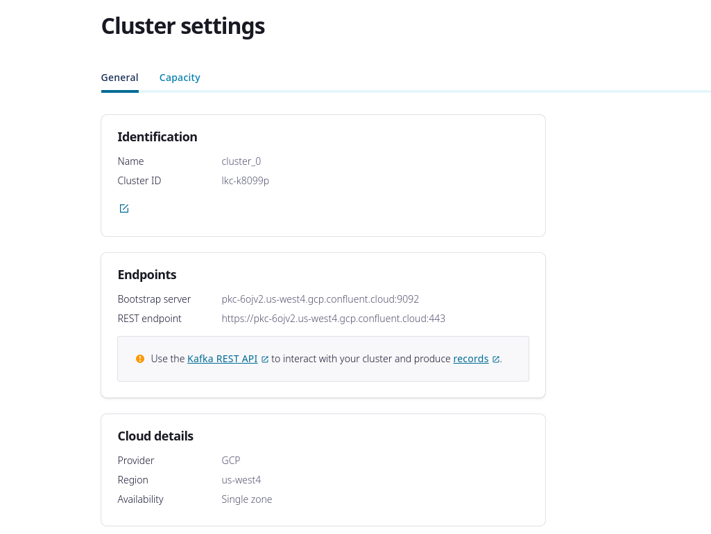
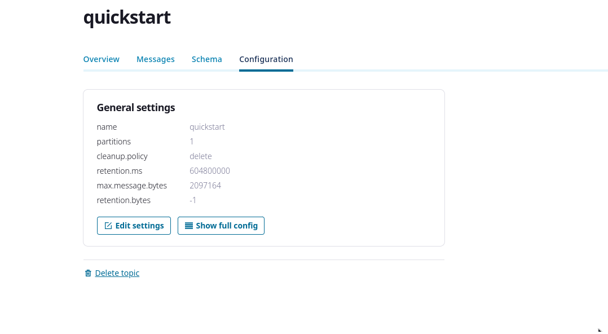

## Membuat kafka cluster

Hari pertama saya mengikuti langkah-langkah membuat cluster kafka di platform confluent cloud dengan nama `cluster_0`.



## Membuat satu topic

Lalu saya membuat satu topic dengan single partition bernama `quickstart`.



Jika ingi membuat topic melalui cli berikut adalah perintahnya

```bash
./bin/kafka-topics --bootstrap-server localhost:9092 \
                   --create \
                   --topic quickstart
```

## Mengirim pesan ke topic

Setelah berhasil membuat topic, saya mencoba mempublish simple message berisikan

```json
{
  "hello": "world"
}
```


Untuk mengirim pesan melalui cli berikut adalah perintahnya

```bash
./bin/kafka-console-producer --bootstrap-server localhost:9092 \
                             --topic quickstart
```

Tuliskan pesan yang mau di kirimkan

```
this is my first kafka message
hello world!
this is my third kafka message. I’m on a roll :-D
```

Jika sudah selesai, tekan **Ctrl-D** untuk kembali ke cli

## Membaca pesan dari sebuah topic

setalah berhasil mengirimkan message ke topic `quickstart` saya mencoba untuk membaca message tersebut.


Untuk membaca pesan melalu cli jalankan perintah berikut untuk membuka `kafka-console-consumer`

```bash
./bin/kafka-console-consumer --bootstrap-server localhost:9092 \
                             --topic quickstart \
                             --from-beginning
```

Maka kita akan mendapatkan pesan yang telah di inputkan tadi sama seperti step sebelumnya

```
this is my first kafka message
hello world!
this is my third kafka message. I’m on a roll :-D
```

## Kesimpulan

Untuk progress di hari pertama ini memang masih basic karena saya ingin merefresh ingatan saya mengenai kafka.
